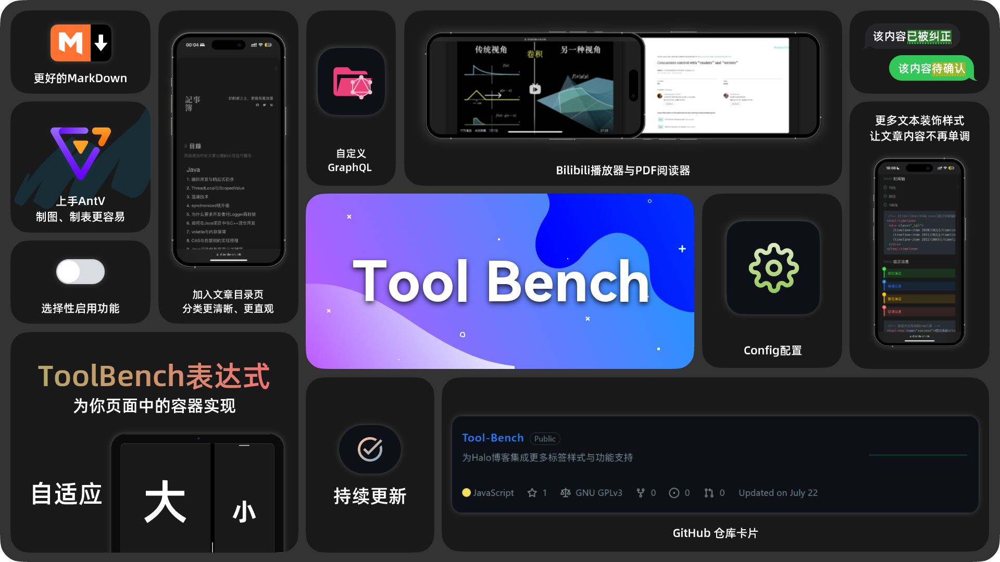

# Tool-Bench
感谢您下载并使用 Tool Bench 插件，本插件为 Halo 2.x 博客集成了更多的API与能力。加入我们的 QQ 交流群 697197698 以获得更好的技术支持。以下是本插件常用的指南和安装方法：

- 基本使用指南：https://dioxide-cn.ink/archives/about-tool-bench
- 扩展样式指南：https://dioxide-cn.ink/archives/tool-bench-style
- 安装方法：
  1. 访问最新的 [Releases](https://github.com/DioxideCN/Tool-Bench/releases) 页面，下载 Assets 中的 JAR 文件
  2. 安装，插件安装和更新方式可参考：https://docs.halo.run/user-guide/plugins

## 开发环境
```shell
git clone git@github.com:DioxideCN/Tool-Bench.git
# 或者当你 fork 之后
git clone git@github.com:{your_github_id}/Tool-Bench.git
```

修改 Halo 程序的环境配置文件：

```yaml
halo:
  plugin:
    runtime-mode: development
    classes-directories:
      - "build/classes"
      - "build/resources"
    lib-directories:
      - "libs"
    fixedPluginPath:
      - "/path/to/Tool-Bench"
```

## 提供issue
提供 issue 时请附带完整的报错信息，并尽可能多地提供一个可复现该错误的环境信息（如：主题、JDK版本、时间等）。

## 贡献代码
Tool Bench 欢迎每一位开发者提交更好更强大的代码，贡献代码时请在 Java doc 中注明`@date`与`@author`。

## 开发手册
在部署完成开发环境后，您可以根据每个类的 Java doc 描述进行进一步开发，或者加入我们的 QQ 交流群以获取帮助。
